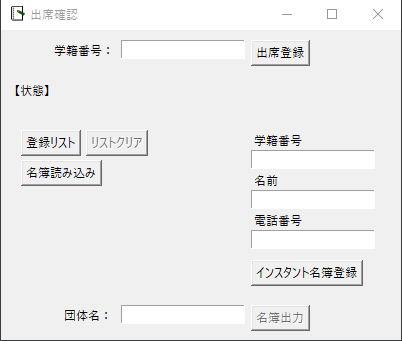
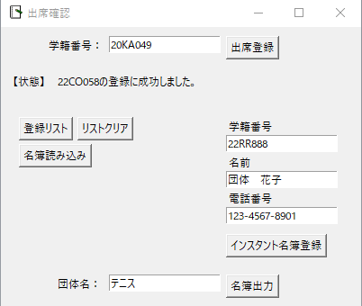
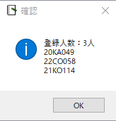
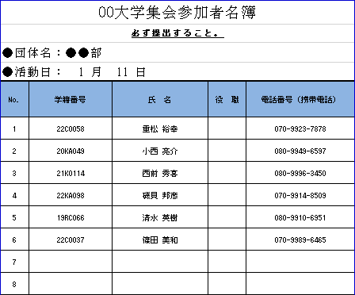

# 出席名簿作成アプリ

出席者を確認、雛形に落とし込むためのツール\n
団体活動に使うため作成

### 機能

* 名簿の読み込み
* 学籍番号から名簿との照合
* 出席者リストの表示
* 名簿にない人を出席者に追加(インスタント名簿登録)
* 出席者表を特定のフォーマットで出力(.xlsx)

### 開発期間
3か月(実稼働1.5か月)

### version

* python 3.6.8
* openpyxl 3.0.10
* pandas 1.1.5

### 実行方法

#### 方法 (pythonで実行)

1. `python install -r requirements.txt`\
2. `python -m meibo`\

### 使い方

#### 読み込んだ名簿を用いて出席登録

1. 「名簿読み込み」のボタンから、名簿を読み込む。(テスト起動時は、「example_meibo.xlsx」を読み込む。)
2. 「学籍番号：」の入力ボックスに学籍番号を入力。(大文字、小文字どちらも対応)
3. 「出席登録」のボタンを押す。
4. 「団体名：」の入力ボックスに団体名(クラブ名)を入力。
5. 「名簿出力」ボタンが有効になるので、ボタンを押して出力。

#### 読み込んだ名簿外の人物を出席者に登録

1. インスタント名簿登録欄の「学籍番号」,「名前」,「電話番号」の入力ボックスにそれぞれ入力。
   入力形式
    * 学籍番号：12XX123
    * 名前　　：姓　名
    * 電話番号：123-4567-8901
2. 「インスタント名簿登録」のボタンを押す。
3. 「団体名」の入力ボックスに団体名(クラブ名)を入力。
4. 「名簿出力」ボタンが有効になるので、ボタンを押して出力。

### サンプル

#### トップ画面
* 名簿を読み込み後、学籍番号を入力、またはインスタント名簿を入力

#### 入力時の画面

#### 登録リストの画面
* 名簿から登録した出席者と、インスタントで登録した出席者の和として表示

#### 読み込む名簿の例
* 読み込む名簿はエクセル形式
* 列ごとのジャンルの順番は固定

#### 出力画面の例
* 出力形式はxlsx形式のみ

